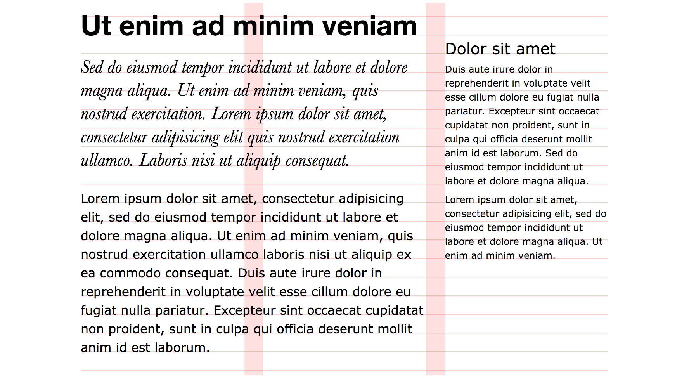

# Order.less

A collection of [LESS][less] libraries for precise control over basic elements of typography:

- [Modular scale](#modular-scale) library supports double-stranded modular scales, and lets you set elements' font size to a value from that scale.
- [Baseline grid](#baseline-grid) library lets you control vertical rhythm of the document by setting padding, margin, offset and height in baseline rows. It can also automatically shift elements to sit on baseline.
- [Column grid](#column-grid) library enables you to define a uniform grid with fixed inner gutters, and set elements' padding, margin, offset and width in columns.

[less]: http://lesscss.org

You can see all of these libraries in action in [this example](./examples/001_Overview/), where some <samp>lorem ipsum</samp> is set in 3 different typefaces and laid out on a 3-column grid:

<a href="./examples/001_Overview/"></a>

* * *

**Requirements**: LESS v2.2.0; [`calc()` support](http://caniuse.com/#feat=calc) for fixed gutters and more precise offsets.    
**Test suite**: [Visual reference](./tests/index.png) ([source](./tests/))

* * *

## Modular scale

Modular scale library supports single- and double-stranded modular scales, and lets you set elements' font size to a value from that scale. You can learn more about modular scales in [More Meaningful Typography](http://alistapart.com/article/more-meaningful-typography) by Tim Brown.

<!--
### Examples

TODO: EXAMPLE: A modular scale and draw AAAAAA
-->

### Mixin reference

You must import the library first:

```less
@import 'path/to/scale.less';
```

#### `.use-modular-scale()`

Generates double- or single-stranded scale or defines a custom scale, and exports other mixins.

##### Parameters

- To generate double- or single-stranded scale:
    1. *pixel* `@base` – primary strand base
    2. (optional) *pixel* `@alternative` – secondary strand base
    3. *number* `@ratio` – scale ratio (must be less than 1)
- To define your custom scale:
    1. *pixel* `@base` – base value
    2. *list* `@values` – list of *pixel* values (must include `@base`)

##### Exports

- For double- or single-stranded scales:
    - *pixel* `@scale-base`
    - (optional) *pixel* `@scale-alternative`
    - *number* `@scale-ratio`
- For custom scales:
    - *pixel* `@scale-base`
    - *list* `@scale-values`

##### Usage

For a double-stranded scale, you need a ratio and two base values for both strands:

```less
.use-modular-scale(16px, 70px, (2/3));
```

After that, you can use `.font-size()` mixin to set `font-size` property of an element:

```less
// ...
.font-size(+6); // font-size: 54.000px; font-size: 3.375rem;
.font-size(+5); // font-size: 46.667px; font-size: 2.917rem;
.font-size(+4); // font-size: 36.000px; font-size: 2.25rem;
.font-size(+3); // font-size: 31.111px; font-size: 1.944rem;
.font-size(+2); // font-size: 24.000px; font-size: 1.5rem;
.font-size(+1); // font-size: 20.741px; font-size: 1.296rem;
.font-size(+0); // font-size: 16.000px; font-size: 1rem;
.font-size(-1); // font-size: 13.827px; font-size: 0.864rem;
.font-size(-2); // font-size: 10.667px; font-size: 0.667rem;
.font-size(-3); // font-size: 9.218px;  font-size: 0.576rem;
// ...
```

You must explicitly set `font-size` property of `html` element to scale base, otherwise <em>rem</em> values may not evaluate to the same amount of <em>pixels</em>:

```less
html {
    font-size: @scale-base;
}
```

In order to generate and use a single-stranded scale, you need a ratio and a base value:

```less
.use-modular-scale(16px, (3/4));
```

And finally, you can define an arbitrary scale by passing a list of valid step values as the second argument:

```less
// Scale steps:         -3   -2   -1    0   +1   +2   +3   +4   +5   +6   +7   +8
.use-modular-scale(16px, 8px 12px 13px 16px 20px 24px 30px 36px 42px 50px 74px 90px);
```


#### `.font-size()`

Sets `font-size` property to a scale value.

##### Parameters

1. *number* `@step`

##### Usage

```less
h1 {
    .font-size(4); // 4th step
}
```

Given the definition above, it will compile to:

```css
h1 {
    font-size: 36px;
    font-size: 2.25rem;
}
```

#### `.get-scale-size()`

Gets a scale value:

##### Parameters

1. *number* `@step` – scale step

##### Exports

- *pixel* `@scale-size`

##### Usage

```less
h1 {
    .get-scale-size(4);
    font-size: @scale-size;
}
```

Which compiles to:

```css
h1 {
    font-size: 36px;
}
```


## Baseline grid

This library lets you control vertical rhythm of the document by setting padding, margin, offset and height in baseline rows. It can also automatically shift elements to sit on baseline, if their font size, line height and/or font family is changed.

Baseline row height is a product of base `font-size` and base `line-height` of the document. For example, if the base `font-size` equals <samp>20px</samp> and base `line-height` equals <samp>1.5</samp>, then baseline row height is <samp>30px</samp>.

Whenever you change any of font property of a block element, its baseline drifts off. In order to preserve baseline alignment you could manually adjust relative position of the element:

```css
h1 {
    font: 700 36px / 1.25 'Helvetica', sans-serif;
    position: relative;
    top: -16px;
}
```

This library can automatically shift the element back to baseline. The offset is primarily a function of `font-size`, `line-height` and `font-family`, and in many cases of `font-variant`, `font-weight` and `font-style`. If we abstract the variability of each typeface variation via special ratio referred to as **baseline offset**, the actual offset is simply a function of `font-size`, `line-height` and `baseline offset`.

Here are baseline offset values for a few popular typefaces:

| Font            | Offset |
|:----------------|-------:|
| Arial           |  0.847 |
| Arial Black     |  0.895 |
| Comic Sans MS   |  0.905 |
| Courier New     |  0.766 |
| Georgia         |  0.849 |
| Impact          |  0.899 |
| Tahoma          |  0.897 |
| Times New Roman |  0.837 |
| Trebuchet MS    |  0.858 |
| Verdana         |  0.898 |

You can find offset values for many other typefaces (and their variations) including popular Google fonts in [HTML source](./tests/index.html) of the test suite.

<!--
### Examples

TODO: EXAMPLE: Horizontal alignment of side by side elements: p, aside > p
TODO: EXAMPLE: Vertical rhythm: h1 + .intro, h2, p with borders, paddings and margins, and 2 fonts.
-->

### Mixin reference

You must import the library first:

```less
@import 'path/to/baseline.less';
```

#### `.use-baseline-grid()`

Defines baseline and exports the other mixins.

##### Parameters

1. *pixel* **or** *number* `@size`
2. *number* `@height`
3. *number* `@offset` **or** *keyword* `@name` 

##### Exports

- *pixel* `@baseline-size`
- *number* `@baseline-height`
- *number* `@baseline-offset`

##### Usage

You can set baseline size in pixels:

```less
.use-baseline-grid(16px, 1.5, 0.898);
```

Or as a scale step:

```less
.use-modular-scale(16px, 20px, (2/3));
.use-baseline-grid(0, 1.5, 0.898);
```

You can also define baseline offset by referencing a font definition:

```less
@verdana-font-family: 'Verdana', sans-serif;
@verdana-font-variation: italic 400;
@verdana-font-offset: 0.898;

.use-baseline-grid(16px, 1.5, verdana);
```

You must set `font-size` and `line-height` properties of `html` element to the same values:

```css
html {
    font-size: @baseline-size;
    line-height: @baseline-height;
}
```

#### `.show-baselines()`

Sets `background` property of an element to show baselines.

```less
main {
    .show-baselines();
}
```

#### `.set-baseline()`

**(Internal)** Defines a new baseline.

##### Parameters

1. *pixel* **or** *number* `@alt-size`
2. (optional) *number* `@alt-height`
3. (optional) *number* `@alt-offset`

##### Exports

- *pixel* `@current-size`
- *number* `@current-height`
- *number* `@current-offset`
- *pixel* `@offset-top-px`
- *pixel* `@offset-bottom-px`
- *rem* `@offset-top-rem`
- *rem* `@offset-bottom-rem`

##### Usage

This mixin is used by `.resize-baseline()`, `.align-baseline()`, `.adjust-baseline()`, `.font()` and `.font-align()`. 

To learn more, please read the [source code](./source/baseline.less).

#### `.reset-baseline()`

**(Internal)** Resets baseline to original state.

#### `.resize-baseline()`, `.align-baseline()`, `.adjust-baseline()`

`.resize-baseline()` simply changes the `font-size` and `line-height` property of the element, `.align-baseline()` realigns the element's baseline, and `.adjust-baseline()` does both.

##### Parameters

1. *pixel* **or** *number* `@size`
2. (optional) *number* `@height`
3. (optional) *number* `@offset`

##### Usage

```less
h1 {
    .adjust-baseline(30px, 1.25, 0.845);
     // where 0.845 is baseline offset for Helvetica
    font-family: Helvetica, sans-serif;
}
h1 + p {
    .resize-baseline(20px, 1.5)
}
```

#### `.font()`, `.font-align()`

`.font()` simply changes the `font` property of the element, while `.font-align()` realigns the element's baseline as well.

##### Parameters

1. *pixel* **or** *number* `@size`
2. (optional) *number* `@height`
3. (optional) *keyword* `@name`

##### Usage

These mixins are available only if you defined primary baseline using a font name:

```less
@helvetica-font-family: 'Helvetica', sans-serif;
@helvetica-font-variation: italic 400;
@helvetica-font-offset: 0.845;

@verdana-font-family: 'Verdana', sans-serif;
@verdana-font-variation: normal 400;
@verdana-font-offset: 0.898;

.use-baseline-grid(16px, 1.5, verdana);
```


```less
h1 {
    .font-align(30px, 1.25, helvetica)
}
h1 + p {
    .font(20px, 1.45, verdana)
}
```

#### `.height()`, `.min-height()`, `.max-height()`, `.top()`, `.bottom()`, `.margin-top()`, `.margin-bottom()`, `.padding-top()`, `.padding-bottom()`

These mixins let you set the respective CSS property in baseline rows.

##### Parameters

1. *number* `@span` – number of rows
2. (optional) *unit* `@nudge`

##### Usage

```less
div {
    .max-height(5);
    .padding-top(2, -1px);
    border-top: 1px solid;
}
```

Which compiles to:

```css
div {
    max-height: 120px;
    max-height: 7.5rem;
    padding: 48px;
    padding: calc(3rem - 1px);
    border-top: 1px solid;
}
```

#### `.get-baseline-height()`

Calculates pixel and rem values for a number of baseline rows.

##### Parameters

1. *number* `@span`

##### Exports

- *pixel* `@baseline-height-px`
- *rem* `@baseline-height-rem`

##### Usage

```less
div {
    .get-baseline-height(2);
    height: @baseline-height-px;
    height: @baseline-height-rem;
}
```

Compiles to:

```css
div {
    height: 48px;
    height: 3rem;
}
```


## Column grid

Column grid library lets you define a uniform grid with fixed inner gutters, and set elements' padding, margin, offset and width in columns. At the moment, it only supports uniform grids with inner gutters, e.g. a 3-column grid has 2 gutters in-between 3 columns of equal width.

<!--
### Examples
TODO: EXAMPLE: Show the 12 column grid without any content
TODO: EXAMPLE: Basic page layout
TODO: EXAMPLE: Item grid
TODO: EXAMPLE: Combining multiple grids
-->

### Mixin reference

You must import the library first:

```less
@import 'path/to/grid.less';
```

#### `.use-column-grid()`

Defines the grid and exports the other mixins.

##### Parameters

1. *pixel* `@width` – optimal grid width
2. *pixel* `@gutter`
3. *number* `@columns`

**Or**:

1. *keyword* `@name`

##### Exports

- *pixel* `@grid-width`
- *pixel* `@grid-gutter`
- *number* `@grid-columns`

##### Usage

```less
.use-column-grid(940px, 20px, 12);
```

Alternatively, you can define a grid as a set of variables and reference it by name:

```less
@desktop-grid-width: 940px;
@desktop-grid-gutter: 20px;
@desktop-grid-columns: 12;

.use-column-grid(desktop);
```

#### `.show-columns()`, `.show-gutters()`

Sets `background` property of an element to show either grid columns and/or gutters.

```less
main {
    .show-columns();
    .show-gutters();
}
```

#### `.width()`, `.min-width()`, `.max-width()`

These mixins let you set the respective CSS property in grid columns.

##### Parameters

1. *number* `@span` – number of columns
2. (optional) *unit* `@nudge` – amount of units to nudge
3. (optional) *number* `@base` – parent width in columns (`@grid-columns` by default)

##### Usage

```less
div {
    .width(6); // set width to 6 columns
    .width(3, 6); // set width to 3 columns in a 6 column grid
    .width(1, -10px, 6); // same as above, but decrease width by 10px 
}
```

#### `.left()`, `.right()`, `.margin-left()`, `.margin-right()`, `.padding-left()`, `.padding-right()`

These mixins let you set the respective CSS property in grid columns.

##### Parameters

1. (optional) *number* `@span` – number of columns the property spans
2. (optional) *unit* `@nudge` – amount of units to nudge
3. (optional) *number* `@base` – parent width in columns (`@grid-columns` by default)

**NB!** You must specify either `@span` or `@nudge`!

##### Usage


```less
div {
    .left(20px); // set left to 20px
    .left(1, 6); // set left to 1 column in a 6 column grid
    .left(1, -10px, 6); // same as above, but nudge element 10px left
}
```

