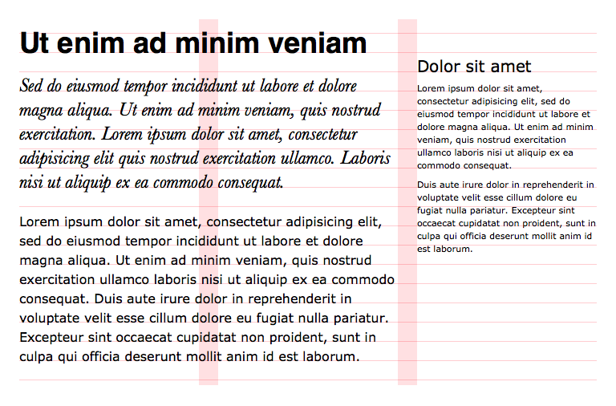

# Order.less

A collection of [LESS][less] libraries for precise control over basic elements of typography:

- [Modular scale](#modular-scale) library lets you define font size as a scale step.
- [Baseline grid](#baseline-grid) library lets you define vertical padding, margin and offset, and height in baseline rows; realigns baseline if you change elements' font size, line height and/or font family.
- [Column grid](#column-grid) library lets you define horizontal padding, margin and offset, and width in columns.

[less]: http://lesscss.org

<a href="./examples/001_Intro/"></a>

* * *

**Requirements**: LESS v1.7.3    
**Visual tests**: [HTML source](./tests/index.html) / [LESS source](./tests/stylesheet.less)

* * *

## Modular scale

Modular scale library lets you define font size as a step on a double-stranded modular scale  as described in [More Meaningful Typography](http://alistapart.com/article/more-meaningful-typography) by Tim Brown.

You must import the library first:

```less
@import 'path/to/scale.less';
```

<!--
TODO: Basic example.
TODO: Repeat some baseline example or create a new one, but use scale steps instead of pixels.
-->

### `.use-modular-scale()`

Defines a scale and exports the other mixins.

##### Parameters

1. *pixel* `@primary` – primary strand base
2. *pixel* `@secondary` – secondary strand base
3. *number* `@ratio` – scale ratio (must be less than 1)

##### Exports

- *pixel* `@scale-base`
- *pixel* `@scale-alternative`
- *number* `@scale-ratio`

##### Usage

```less
.use-modular-scale(16px, 70px, (2/3));
```

The mixin accepts the same three parameters as [this tool](http://modularscale.com) and will effectively produce [the same result](http://modularscale.com/scale/?px1=16&px2=20&ra1=1.5):

```less
// ...
.font-size(+6); // font-size: 54.000px; font-size: 3.375rem;
.font-size(+5); // font-size: 46.667px; font-size: 2.917rem;
.font-size(+4); // font-size: 36.000px; font-size: 2.25rem;
.font-size(+3); // font-size: 31.111px; font-size: 1.944rem;
.font-size(+2); // font-size: 24.000px; font-size: 1.5rem;
.font-size(+1); // font-size: 20.741px; font-size: 1.296rem;
.font-size(+0); // font-size: 16.000px; font-size: 1rem;
.font-size(-1); // font-size: 13.827px; font-size: 0.864rem;
.font-size(-2); // font-size: 10.667px; font-size: 0.667rem;
.font-size(-3); // font-size: 9.218px;  font-size: 0.576rem;
// ...
```

You must set `font-size` property of `html` element to the same value, otherwise <em>rem</em> values may not evaluate to the same amount of <em>pixels</em>:

```html
html {
    font-size: @scale-base;
}
```

### `.font-size()`

Sets `font-size` property to a certain scale step.

##### Parameters

1. *number* `@step`

##### Usage

```less
h1 {
    .font-size(4); // 4th step
}
```

Given the definition above, it will compile to:

```css
h1 {
    font-size: 36px;
    font-size: 2.25rem;
}
```


### `.get-scale-size()`

Calculates *pixel* value for any scale step:

##### Parameters

1. *number* `@step` – scale step

##### Exports

- *pixel* `@scale-size`

##### Usage

```less
h1 {
    .get-scale-size(4);
    font-size: @scale-size;
}
```

Which compiles to:

```css
h1 {
    font-size: 36px;
}
```


## Baseline grid

Baseline grid library lets you define vertical padding, margin and offset, and height in baseline rows. It can also realign an element's baseline if you change its font size, line height and/or font family.

Baseline height is a product of base `font-size` and base `line-height` of the document. For example, if the base `font-size` equals <samp>20px</samp> and base `line-height` equals <samp>1.5</samp>, then baseline height equals <samp>30px</samp>.

<!--
    TODO: Dwell on baseline offset theory.
-->

You must import the library first:

```less
@import 'path/to/baseline.less';
```

<!--
TODO: Horizontal alignment of side by side elements: p, aside > p
TODO: Vertical rhythm: h1 + .intro, h2, p with borders, paddings and margins, and 2 fonts.
-->

### `.use-baseline-grid()`

Defines baseline and exports the other mixins.

##### Parameters

1. *pixel* **or** *number* `@size`
2. *number* `@height`
3. *number* `@offset` **or** *keyword* `@name` 

##### Exports

- *pixel* `@baseline-size`
- *number* `@baseline-height`
- *number* `@baseline-offset`

##### Usage

You can set baseline size in pixels:

```less
.use-baseline-grid(16px, 1.5, 0.898);
```

Or as a scale step:

```less
.use-modular-scale(16px, 20px, (2/3));
.use-baseline-grid(0, 1.5, 0.898);
```

You can also define baseline offset by referencing a font definition:

```less
@verdana-font-family: 'Verdana', sans-serif;
@verdana-font-variation: italic 400;
@verdana-font-offset: 0.898;

.use-baseline-grid(16px, 1.5, verdana);
```

You must set `font-size` and `line-height` properties of `html` element to the same values:

```html
html {
    font-size: @baseline-size;
    line-height: @baseline-height;
}
```


### `.show-baselines()`

Sets `background` property of an element to show baselines.

```less
main {
    .show-baselines();
}
```


### `.resize-baseline()`, `.adjust-baseline()`

`.resize-baseline()` simply changes the `font-size` and `line-height` property of the element, while `.adjust-baseline()` realigns the element's baseline as well.

##### Parameters

1. *pixel* **or** *number* `@size`
2. (optional) *number* `@height`
3. (optional) *number* `@offset`

##### Usage

```less
h1 {
    .adjust-baseline(30px, 1.25, 0.845); // where 0.845 is baseline offset for Helvetica
    font-family: Helvetica, sans-serif;
}
h1 + p {
    .resize-baseline(20px, 1.5)
}
```

### `.font()`, `.font-align()`

`.font()` simply changes the `font` property of the element, while `.font-align()` realigns the element's baseline as well.

##### Parameters

1. *pixel* **or** *number* `@size`
2. (optional) *number* `@height`
3. (optional) *keyword* `@name`

##### Usage

These mixins are available only if you defined baseline offset using a font definition:

```less
@helvetica-font-family: 'Helvetica', sans-serif;
@helvetica-font-variation: italic 400;
@helvetica-font-offset: 0.845;

@verdana-font-family: 'Verdana', sans-serif;
@verdana-font-variation: normal 400;
@verdana-font-offset: 0.898;

.use-baseline-grid(16px, 1.5, verdana);
```


```less
h1 {
    .font-align(30px, 1.25, helvetica)
}
h1 + p {
    .font(20px, 1.45, verdana)
}
```


### `.height()`, `.min-height()`, `.max-height()`, `.top()`, `.bottom()`, `.margin-top()`, `.margin-bottom()`, `.padding-top()`, `.padding-bottom()`

These mixins let you define the respective CSS property in baseline rows.

##### Parameters

1. *number* `@span` – number of rows
2. (optional) *unit* `@nudge`

##### Usage

```less
div {
    .max-height(5);
    .padding-top(2, -1px);
    border-top: 1px solid;
}
```

Which compiles to:

```css
div {
    max-height: 120px;
    max-height: 7.5rem;
    padding: 48px;
    padding: calc(3rem - 1px);
    border-top: 1px solid;
}
```

### `.get-baseline-height()`

Calculates pixel and rem values for a number of baseline rows.

##### Parameters

1. *number* `@span`

##### Exports

- *pixel* `@baseline-height-px`
- *rem* `@baseline-height-rem`

##### Usage

```less
div {
    .get-baseline-height(2);
    height: @baseline-height-px;
    height: @baseline-height-rem;
}
```

Compiles to:

```css
div {
    height: 48px;
    height: 3rem;
}
```


## Column grid

Column grid library lets you define horizontal padding, margin and offset, and width in columns. At the moment, it only supports uniform grids with inner gutters, e.g. a <samp>3</samp>-column grid has <samp>2</samp> gutters in between those columns.

You must import the library first:

```less
@import 'path/to/grid.less';
```

<!--
TODO: Show the 12 column grid without any content
TODO: Basic page layout
TODO: Item grid
TODO: Combining multiple grids
-->

### `.use-column-grid()`

Defines the grid and exports the other mixins.

##### Parameters

1. *pixel* `@width` – optimal grid width
2. *pixel* `@gutter`
3. *number* `@columns`

**Or**:

1. *keyword* `@name`

##### Exports

- *pixel* `@grid-width`
- *pixel* `@grid-gutter`
- *number* `@grid-columns`

##### Usage

```less
.use-column-grid(940px, 20px, 12);
```

Alternatively, you can define a grid as a set of variables and reference it by name:

```less
@desktop-grid-width: 940px;
@desktop-grid-gutter: 20px;
@desktop-grid-columns: 12;

.use-column-grid(desktop);
```

### `.show-columns()`, `.show-gutters()`

Sets `background` property of an element to show either grid columns or gutters.

```less
main {
    .show-columns();
}
```

### `.width()`, `.min-width()`, `.max-width()`

These mixins let you define the respective CSS property in grid columns.

##### Parameters

1. *number* `@span` – number of columns
2. (optional) *unit* `@nudge` – amount of units to nudge
3. (optional) *number* `@base` – number of columns parent container spans

##### Usage

```less
div {
    .width(6);
    
    > div {
        .width(3, 6);
    }
    
    > span {
        .width(1, -10px, 6);
    }
}
```

### `.left()`, `.right()`, `.margin-left()`, `.margin-right()`, `.padding-left()`, `.padding-right()`

These mixins let you define the respective CSS property in grid columns.

##### Parameters

1. (optional) *number* `@span` – number of columns this element spans
2. (optional) *unit* `@nudge` – amount of units to nudge
3. (optional) *number* `@base` – number of columns parent container spans

**NB!** You must specify either `@span` or `@nudge`!

##### Usage

```less
div {
    .left(20px);
    .margin-left(-3);
    .padding-left(1, 20px);
}
```


## Acknowledgments

Hat tips and heartily thanks go to:

- [Khoi Vinh](https://twitter.com/khoi) and [Mark Boulton](https://twitter.com/markboulton) for inadvertently drilling down the basics of typography and the importance of grids into my silly developer head.
- [Tim Brown](https://twitter.com/timbrown) for furthering my understanding of typography in general and modular scales in particular.
- [Elliot Jay Stock](https://twitter.com/elliotjaystocks) for blogging about [the relevance of the baseline grid](http://www.elliotjaystocks.com/blog/the-relevance-of-the-baseline-grid/).