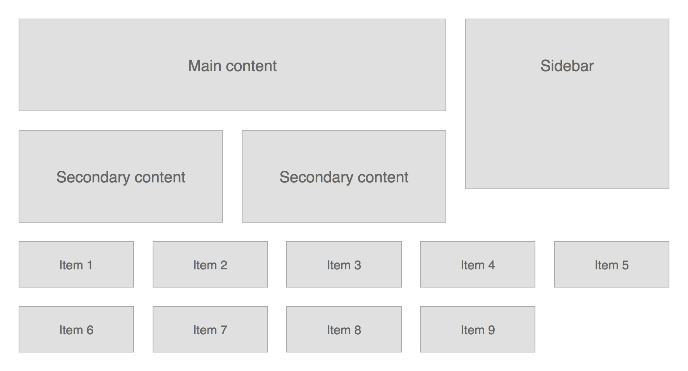

# Order.less

Order.less is a library of [Less][less] mixins for precise control over typographic contrast, rhythm and layout. It was designed to fit seamlessly into any project and does not put any restrictions on your stylesheet structure. Instead of using standard units you define properties that affect vertical space in baselines, or columns for horizontal space properties, and scale steps for font sizes.

Order.less is made of three loosely coupled modules:

- [Column grid](#column-grid) mixins enable you to define a uniform grid with fixed inner gutters, and set elements' padding, margin, offset and width in columns.
- [Baseline grid](#baseline-grid) mixins let you control vertical rhythm of the document by setting padding, margin, offset and height in baseline rows. It can also automatically shift elements to sit on baseline.
- [Modular scale](#modular-scale) mixins let you define a custom modular scale and set elements' font size to a value from that scale.

[less]: http://lesscss.org


* * *

**Requirements**: Less v2.2.0; [`calc()` support](http://caniuse.com/calc) for fixed gutters and more precise vertical rhythm.   
**Test suite**: [Visual reference](tests/index.png) ([source](tests/))

```
bower install order.less
npm install order.less
```

* * *


## Column grid

Column grid mixins let you define a uniform grid with fixed inner gutters, and set elements' padding, margin, offset and width in columns. At the moment, only uniform grids with inner gutters are supported, e.g. a 3-column grid will have 2 gutters between 3 columns of equal width.

### Example

Here is an example of a basic layout implemented using this module:

<a href="examples/002_Columns/"></a>

HTML code (see [full listing](examples/002_Columns/index.html)):

```html
<div id="content">
	<div class="primary">Main content</div>
	<div class="secondary">Secondary content</div>
	<div class="secondary">Secondary content</div>
</div>

<div id="sidebar">Sidebar</div>

<ul id="grid"><!--
	We must bust the whitespace around all items, because 
	they will be rendered as inline blocks.
 --><li>Item 1</li><!--
 --><li>Item 2</li><!--
 --><li>Item 3</li><!--
 --><li>Item 4</li><!--
 --><li>Item 5</li><!--
 --><li>Item 6</li><!--
 --><li>Item 7</li><!--
 --><li>Item 8</li><!--
 --><li>Item 9</li><!--
--></ul>
```

Less code (see [full listing](examples/002_Columns/stylesheet.less)):

```less
@default-grid-width: 840px;
@default-grid-gutter: 24px;
@default-grid-columns: 3;

@items-grid-width: @default-grid-width;
@items-grid-gutter: @default-grid-gutter;
@items-grid-columns: 5;

.use-column-grid(default);

#content {
	float: left;
	.width(2);
	
	> .secondary {
		float: left;
		.width(1, 2);
		
		& + .secondary {
			.margin-left(@grid-gutter, 2);
		}
	}
}
#sidebar {
	float: right;
	.width(1);
}
#grid {
	.use-column-grid(items);
	
	> * {
		display: inline-block;
		.width(1);
		.margin-right(@grid-gutter);
		vertical-align: top;
		
		&:nth-child(5n) {
			.margin-right(0);
		}
	}
}
```


### Mixin reference

#### `.use-column-grid()`

Defines the grid and exports other mixins.

##### Parameters

1. *pixel* `@width` – optimal grid width
2. *pixel* `@gutter`
3. *number* `@columns`

**Or**:

1. *keyword* `@name`

##### Exports

- *pixel* `@grid-width`
- *pixel* `@grid-gutter`
- *number* `@grid-columns`

##### Usage

```less
.use-column-grid(940px, 20px, 12);
```

Alternatively, you can define a grid as a set of variables and reference it by name:

```less
@desktop-grid-width: 940px;
@desktop-grid-gutter: 20px;
@desktop-grid-columns: 12;

.use-column-grid(desktop);
```

#### `.show-columns()`, `.show-gutters()`

Sets `background` property of an element to show grid columns and/or gutters.

##### Parameters

1. (optional) *number* `@span` – number of columns
2. (optional) *color* `@color` – base fill color 

##### Usage

```less
main {
	.show-columns(3, blue);
	.show-gutters(5, green);
}
```

It should render like this in the browser:


#### `.width()`, `.min-width()`, `.max-width()`

These mixins let you set the respective CSS property in grid columns.

##### Parameters

1. *number* `@span` – number of columns
2. (optional) *pixel* `@nudge` – amount of pixels to nudge
3. (optional) *number* `@base` – parent width in columns
4. (optional) *pixel* `@base-nudge` – amount of pixels parent width was nudged by

##### Usage

```less
div {
    .width(6); // set width to 6 columns
    .width(3, 6); // set width to 3 columns in a 6 column grid
    .width(1, -10px, 6); // same as above, but decrease width by 10px 
}
```


#### `.left()`, `.right()`, `.margin-left()`, `.margin-right()`, `.padding-left()`, `.padding-right()`

These mixins let you set the respective CSS property in grid columns.

##### Parameters

1. (optional) *number* `@span` – number of columns the property spans
2. (optional) *pixel* `@nudge` – amount of pixels to nudge
3. (optional) *number* `@base` – parent width in columns
4. (optional) *pixel* `@base-nudge` – amount of pixels parent width was nudged by

**NB!** You must specify either `@span` or `@nudge`!

##### Usage

```less
div {
    .left(20px); // set left to 20px
    .left(1, 6); // set left to 1 column in a 6 column grid
    .left(1, -10px, 6); // same as above, but nudge element 10px left
}
```


## Baseline grid

These mixins let you control vertical rhythm of the document by setting padding, margin, offset and height in baseline rows. It can also automatically shift elements to sit on baseline, if their font size, line height and/or font family is changed.

### Example

A body of copy is set in three typefaces are used in this example, with its vertical rhythm and baseline alignment preserved throughout:

<a href="examples/003_Baselines/"></a>

HTML code (see [full listing](examples/003_Baselines/index.html)):

```html
<h1>Eu vim fugit constituto sadipscing</h1>

<blockquote>
	<p>Lorem ipsum dolor sit amet, mel sumo salutandi ea, et dolorem similique vel. Graeco percipit repudiare eum ut, per aeque graecis id. Per eu euismod euripidis, mel no oratio recteque. Sumo aliquid ea his, ad ius autem expetenda.</p>
</blockquote>

<p>No semper omnesque duo, ex mea abhorreant scribentur. Pro nemore comprehensam at. In praesent assentior mea, id decore dolore nam. Ea nec diam errem primis, id pro dolores forensibus instructior, alii natum adipiscing ne vis. Stet movet audiam ad his, an mel omittam persequeris.</p>

<p>Cu omnis delectus nam, eu atqui minimum eum, numquam equidem scaevola te mea. Cum ut probo clita, vivendo accumsan sententiae et eum. Eos no eros repudiandae, ex sit vidit meliore invenire. Nibh mentitum consulatu ei nam. Sed ad scripserit suscipiantur, duo ut case omnis evertitur:</p>


<ul>
	<li>Id eum paulo appareat, ex cum habeo molestiae, eum nullam aliquam no. Possit delenit definitiones ad est, tollit tamquam malorum ea sit.</li>
	<li>Id ignota habemus urbanitas vis.</li>
	<li>Ne his alia imperdiet evertitur, est quas eripuit verterem ad. Mei ex iusto urbanitas scripserit. Malorum meliore postulant ut nam.</li>
	<li>Ut quas erant tractatos vis. At timeam corrumpit dissentiunt ius, vel ei erat laboramus, est no graeco eloquentiam. Alii feugait sed an.</li>
	<li>Eu vim fugit constituto sadipscing. Usu quot aliquip volutpat id, ut veritus vituperatoribus pro.</li>
</ul>

<p>Sed labitur pertinacia constituam in, eu graeco meliore instructior sit, nominati efficiendi theophrastus nec et.</p>
```

Less code (see [full listing](examples/003_Baselines/stylesheet.less)):

```less
@main-font-family: 'Verdana', sans-serif;
@main-font-variation: 400;
@main-font-offset: 0.898;

@heading-font-family: 'Helvetica Neue', sans-serif;
@heading-font-variation: 700;
@heading-font-offset: 0.879;

@quote-font-family: 'Didot', serif;
@quote-font-variation: italic 400;
@quote-font-offset: 0.85;

.use-baseline-grid(16px, 1.5, main);
.use-column-grid(680px, 24px, 3);

html {
	font: @baseline-size / @baseline-height @main-font-family;
}

h1 {
	.font-align(36px, 1.25, heading);
	.padding-top(1);
	.padding-bottom(0.5);
	border-bottom: 2px solid;
	.margin-bottom(1.5, -2px);
}

p {
	.margin-bottom(1);
}

blockquote {
	float: right;
	.width(1.5);
	.margin-left(@grid-gutter);
	.font-align(24px, (5/6 * @baseline-height), quote);
	
	p {
		.margin-bottom(1);
	}
}

ul {
	position: relative;
	list-style: none;
	.margin-bottom(1);
	
	li {
		.margin-bottom(0.25);
		.padding-left(@grid-gutter);
		
		&:before {
			position: absolute;
			left: 0;
			content: "\2013";
		}
	}
}
```


### A bit of theory

Baseline row height is a product of base `font-size` and base `line-height` of the document. For example, if the base `font-size` equals <samp>20px</samp> and base `line-height` equals <samp>1.5</samp>, then baseline row height is <samp>30px</samp>.

Whenever you change any of font property of a block element, its baseline drifts off the parent baseline. In order to preserve baseline alignment you could manually adjust relative position of the element:

```css
h1 {
    font: 700 36px / 1.25 'Helvetica', sans-serif;
    position: relative;
    top: -16px;
}
```

These mixins can help automatically shift the element back to baseline. The offset is primarily a function of `font-size`, `line-height` and `font-family`, and in many cases of `font-variant`, `font-weight` and `font-style`. If we abstract the variability of each typeface variation via special ratio referred to as **baseline offset**, the actual offset is simply a function of `font-size`, `line-height` and `baseline offset`.

Here are baseline offset values for a few popular typefaces:

| Font            | Offset |
|:----------------|-------:|
| Arial           |  0.847 |
| Arial Black     |  0.895 |
| Comic Sans MS   |  0.905 |
| Courier New     |  0.766 |
| Georgia         |  0.849 |
| Impact          |  0.899 |
| Tahoma          |  0.897 |
| Times New Roman |  0.837 |
| Trebuchet MS    |  0.858 |
| Verdana         |  0.898 |

You can find offset values for many other typefaces (and their variations) including popular Google fonts in [HTML source](tests/index.html) of the test suite.


### Mixin reference

#### `.use-baseline-grid()`

Defines baseline and exports other mixins.

##### Parameters

1. *pixel* **or** *number* `@size`
2. *number* `@height`
3. *number* `@offset` **or** *keyword* `@name` 

##### Exports

- *pixel* `@baseline-size`
- *number* `@baseline-height`
- *number* `@baseline-offset`

##### Usage

You can set baseline size in pixels:

```less
.use-baseline-grid(16px, 1.5, 0.898);
```

Or as a scale step:

```less
.use-modular-scale(16px, 8px 12px 13px 16px 20px 24px 30px 36px 42px 50px 74px 90px);
.use-baseline-grid(0, 1.5, 0.898);
```

You can also define baseline offset by referencing a font definition:

```less
@verdana-font-family: 'Verdana', sans-serif;
@verdana-font-variation: italic 400;
@verdana-font-offset: 0.898;

.use-baseline-grid(16px, 1.5, verdana);
```

You must set `font-size` and `line-height` properties of `html` element to the same values:

```less
html {
    font-size: @baseline-size;
    line-height: @baseline-height;
}
```

#### `.show-baselines()`

Sets `background` property of an element to show baselines.

##### Parameters

1. (optional) *number* `@offset`
2. (optional) *color* `@color`

##### Usage

```less
main {
    .show-baselines();
}
```

#### `.font()`, `.font-align()`

`.font()` just changes the `font-*` and `line-height` properties of the element, while `.font-align()` adjusts the element's offset to sit on the baseline as well.

##### Parameters

1. *pixel* **or** *number* `@size`
2. (optional) *number* `@height`
3. (optional) *keyword* `@name` **or** *number* `@offset`

**NB!** You can specify `@size` in pixels *or* as a step on a modular scale, if you are using one ([see below](#modular-scale)).

##### Usage

Provided we define the document baseline as follows:

```less
@helvetica-font-family: 'Helvetica', sans-serif;
@helvetica-font-variation: italic 400;
@helvetica-font-offset: 0.845;

@verdana-font-family: 'Verdana', sans-serif;
@verdana-font-variation: normal 400;
@verdana-font-offset: 0.898;

.use-baseline-grid(16px, 1.5, verdana);
```

...we can set the font properties like this:

```less
h1 {
    .font-align(30px, 1.25, helvetica);
}
h1 + p {
    .font(20px, 1.45);
}
```

...which, once compiled, looks like this...

```css
h1 {
    position: relative;
    top: -10.732px;
    top: -0.67075rem;
    font: italic 400 30px / 1.25 'Helvetica', sans-serif;
    font-size: 1.875rem;
}
h1 + p {
    font: normal 400 20px / 1.45 'Verdana', sans-serif;
    font-size: 1.25rem;
}
```

#### `.height()`, `.min-height()`, `.max-height()`, `.top()`, `.bottom()`, `.margin-top()`, `.margin-bottom()`, `.padding-top()`, `.padding-bottom()`

These mixins let you set the respective CSS property in baseline rows.

##### Parameters

1. *number* `@span` – number of rows
2. (optional) *pixel* `@nudge`

##### Usage

```less
div {
    .max-height(5);
    .padding-top(2, -1px);
    border-top: 1px solid;
}
```

...which compiles to...

```css
div {
    max-height: 120px;
    max-height: 7.5rem;
    padding: 48px;
    padding: calc(3rem - 1px);
    border-top: 1px solid;
}
```

#### `.get-baseline-height()`

Calculates pixel and rem values for a number of baseline rows.

##### Parameters

1. *number* `@span`

##### Exports

- *pixel* `@baseline-height-px`
- *rem* `@baseline-height-rem`

##### Usage

```less
div {
    .get-baseline-height(2);
    height: @baseline-height-px;
    height: @baseline-height-rem;
}
```

...compiles to...

```css
div {
    height: 48px;
    height: 3rem;
}
```


## Modular scale

Modular scale mixins let you define a custom modular scale and set elements' font size to a value from that scale. You can learn more about modular scales in [More Meaningful Typography](http://alistapart.com/article/more-meaningful-typography) by Tim Brown.


### Mixin reference

#### `.use-modular-scale()`

Defines a custom scale and exports other mixins.

##### Parameters

1. *pixel* `@base` – base value
2. *list* `@values` – list of *pixel* values (must include `@base` value)

##### Exports

- *pixel* `@scale-base`
- *list* `@scale-values`

##### Usage

You can define an arbitrary scale by passing a list of valid step values as the second argument:

```less
// Scale steps:         -3   -2   -1    0   +1   +2   +3   +4   +5   +6   +7   +8
.use-modular-scale(16px, 8px 12px 13px 16px 20px 24px 30px 36px 42px 50px 74px 90px);
```

After that, you can use `.font-size()` mixin to set `font-size` property of an element:

```less
h1 {
    .font-size(+6); // font-size: 50px; font-size: 3.125rem;
}
h2 {
    .font-size(+5); // font-size: 42px; font-size: 2.625rem;
}
h3 {
    .font-size(+4); // font-size: 36px; font-size: 2.25rem;
}
h1 + p {
    .font-size(+2); // font-size: 24px; font-size: 1.5rem;
}
p {
    .font-size(+0); // font-size: 16px; font-size: 1rem;
}
footer {
    .font-size(-1); // font-size: 13px; font-size: 0.8125rem;
}
```

You must explicitly set `font-size` property of `html` element to `@scale-base`, otherwise <em>rem</em> values may not evaluate to the same amount of <em>pixels</em>:

```less
html {
    font-size: @scale-base;
}
```


#### `.font-size()`

Sets `font-size` property to a scale value.

##### Parameters

1. *number* `@step`

##### Usage

```less
h1 {
    .font-size(4); // 4th step
}
```

Given the definition above, it will compile to:

```css
h1 {
    font-size: 36px;
    font-size: 2.25rem;
}
```

#### `.get-scale-size()`

Gets a scale value:

##### Parameters

1. *number* `@step` – scale step

##### Exports

- *pixel* `@scale-size`

##### Usage

```less
h1 {
    .get-scale-size(4);
    font-size: @scale-size;
}
```

...compiles to...

```css
h1 {
    font-size: 36px;
}
```

